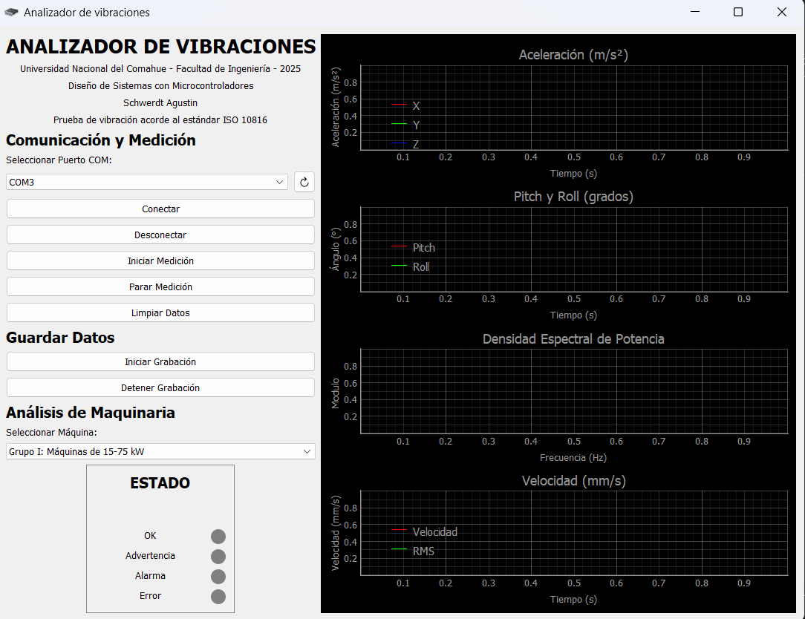

# Analizador de Vibraciones

## Descripción
Analizador de Vibraciones es una aplicación diseñada para conectarse con una IMU mediante puerto serie, ya sea Bluetooth o USB, para realizar mediciones de aceleración, pitch y roll, Densidad Espectral de Potencia (PSD) y velocidad en tiempo real. Además, cuenta con la posibilidad de exportar los datos crudos medidos de aceleración en un archivo .csv para su posterior análisis.

También permite analizar la condición de un motor rotativo estático, siguiendo la norma ISO 10816.

Esta aplicación fue desarrollada en el marco de la materia Diseño de Sistemas con Microcontroladores de la Facultad de Ingeniería de la Universidad Nacional del Comahue.

## Características
- Conexión con IMU mediante puerto serie (Bluetooth o USB)
- Medición en tiempo real de:
  - Aceleración
  - Pitch y Roll
  - Densidad Espectral de Potencia (PSD)
  - Velocidad
- Exportación de datos crudos a archivo .csv
- Análisis de condición de motor rotativo estático según norma ISO 10816

## Requisitos
- Python 3.x
- PyQt5
- pyqtgraph
- pyserial

## Instalación
1. Clona este repositorio:
    git clone https://github.com/Ogas123/analizador-de-vibraciones.git
2. Navega al directorio del proyecto:
    cd analizador-de-vibraciones
3. Instala las dependencias:
    pip install -r requirements.txt
4. Ejecuta la aplicación:
    python main.py
5. Selecciona el puerto COM correspondiente y comienza la medición.

## Contacto
agustinschwerdt@gmail.com